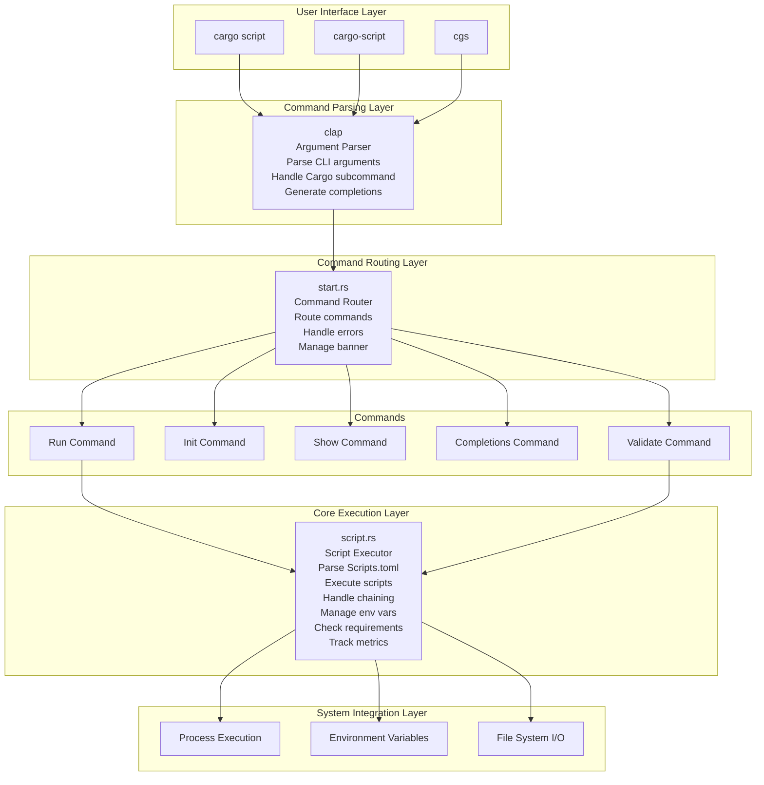
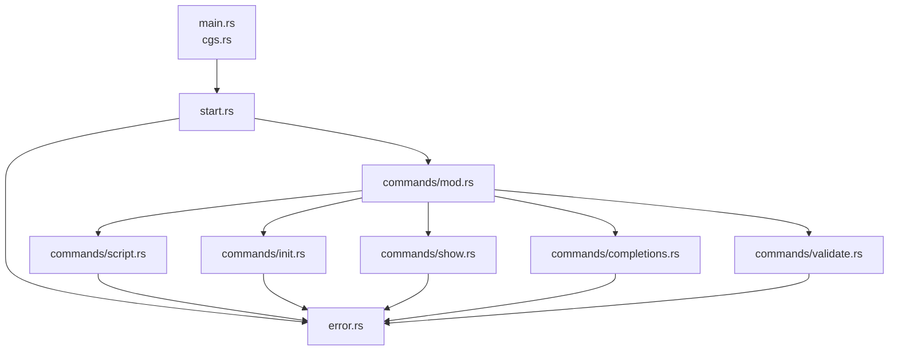
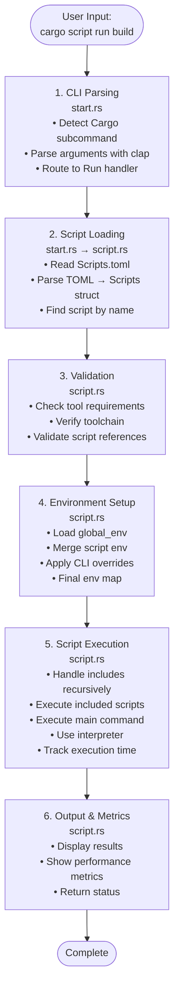
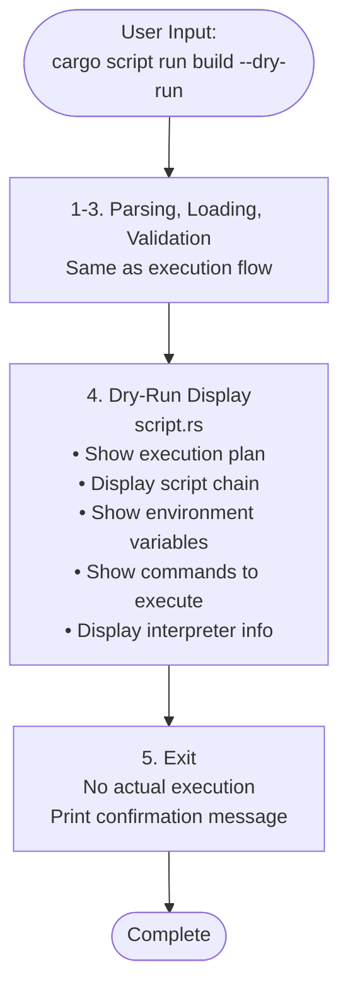
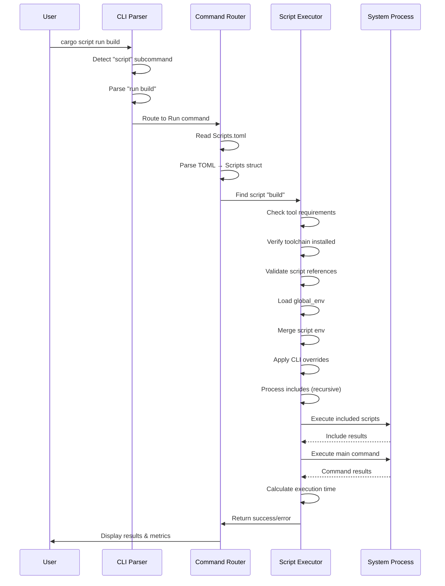
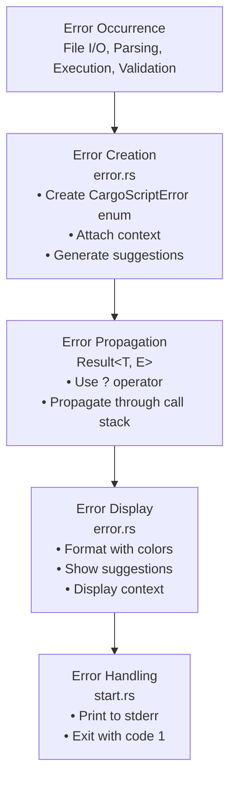
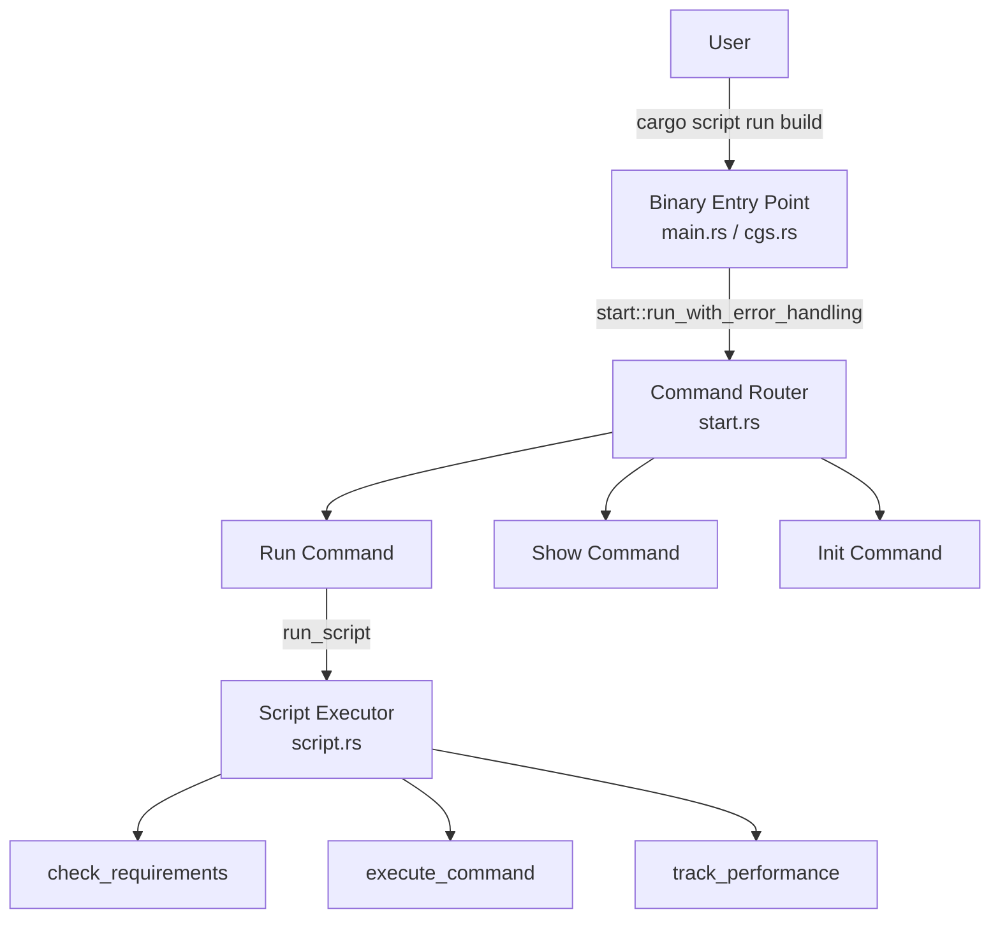

# Project Overview: cargo-run

> **A powerful, fast, and developer-friendly CLI tool for managing project scripts in Rust**

---

## Table of Contents

-   [Project Goals](#project-goals)
-   [Architecture Overview](#architecture-overview)
-   [Module Structure](#module-structure)
-   [Data Flow](#data-flow)
-   [Key Components](#key-components)
-   [Command Execution Flow](#command-execution-flow)
-   [Error Handling](#error-handling)
-   [Testing Strategy](#testing-strategy)
-   [Contributing Guide](#contributing-guide)

---

## Project Goals

### Primary Objectives

1. **Unified Script Management**

    - Provide a single, consistent way to manage all project automation scripts
    - Eliminate the need for scattered shell scripts and Makefiles
    - Support complex workflows through script chaining

2. **Rust Ecosystem Integration**

    - Seamless integration with Cargo (`cargo script` subcommand)
    - Native support for Rust toolchains via rustup
    - Built with Rust, for Rust projects

3. **Developer Experience Excellence**

    - Fast startup times (<100ms)
    - Zero runtime dependencies (single binary)
    - Modern CLI UX (completions, dry-run, helpful errors)
    - Cross-platform support (Windows, macOS, Linux)

4. **Production Ready**
    - CI/CD integration support
    - Validation and error checking
    - Performance metrics tracking
    - Comprehensive error handling

### Design Principles

-   **Simplicity**: Easy to learn, easy to use
-   **Composability**: Scripts can be chained and combined
-   **Type Safety**: Leverage Rust's type system for correctness
-   **Performance**: Fast execution with minimal overhead
-   **Extensibility**: Support for multiple interpreters and toolchains

---

## Architecture Overview

### High-Level Architecture



---

## Module Structure

### Directory Layout

```
cargo-script/
├── src/
│   ├── lib.rs              # Library root, exports public modules
│   ├── main.rs             # Binary entry point (cargo-script)
│   ├── cgs.rs              # Binary entry point (cgs alias)
│   ├── start.rs            # Command routing and CLI initialization
│   ├── error.rs            # Custom error types and error handling
│   └── commands/           # Command implementations
│       ├── mod.rs          # Command enum and module exports
│       ├── script.rs       # Script execution logic
│       ├── init.rs         # Scripts.toml initialization
│       ├── show.rs         # Script listing and display
│       ├── completions.rs  # Shell completion generation
│       └── validate.rs     # Script validation logic
├── tests/                  # Integration tests
│   ├── test_script_commands.rs
│   ├── test_dry_run.rs
│   ├── test_error_messages.rs
│   ├── test_validate.rs
│   ├── test_completions.rs
│   ├── test_cargo_subcommand.rs
│   └── ...
├── docs/
│   └── project_overview.md  # This file
└── Cargo.toml              # Project manifest
```

### Module Dependency Graph



### Module Responsibilities

| Module                      | Responsibility                      | Key Functions                                               |
| --------------------------- | ----------------------------------- | ----------------------------------------------------------- |
| **start.rs**                | CLI initialization, command routing | `run()`, `run_with_error_handling()`                        |
| **error.rs**                | Error types and formatting          | `CargoScriptError`, error display                           |
| **commands/script.rs**      | Script execution engine             | `run_script()`, `execute_command()`, `check_requirements()` |
| **commands/init.rs**        | Scripts.toml initialization         | `init_script_file()`                                        |
| **commands/show.rs**        | Script listing                      | `show_scripts()`                                            |
| **commands/completions.rs** | Shell completion generation         | `generate_completions()`                                    |
| **commands/validate.rs**    | Script validation                   | `validate_scripts()`, `print_validation_results()`          |

---

## Data Flow

### Script Execution Flow



### Dry-Run Flow



---

## Key Components

### 1. Script Data Structures

```rust
// Script representation (supports multiple formats)
pub enum Script {
    Default(String),                    // Simple: "cargo build"
    Inline {                           // Inline format
        command: Option<String>,
        requires: Option<Vec<String>>,
        toolchain: Option<String>,
        info: Option<String>,
        env: Option<HashMap<String, String>>,
        include: Option<Vec<String>>,
        interpreter: Option<String>,
    },
    CILike {                           // CI/CD-like format
        script: String,
        // ... same fields as Inline
    }
}

// Scripts collection
pub struct Scripts {
    pub global_env: Option<HashMap<String, String>>,
    pub scripts: HashMap<String, Script>
}
```

### 2. Error Handling System

```rust
pub enum CargoScriptError {
    ScriptFileNotFound { path, source },
    InvalidToml { path, message, line },
    ScriptNotFound { script_name, available_scripts },
    ToolNotFound { tool, required_version, suggestion },
    ToolchainNotFound { toolchain, suggestion },
    ExecutionError { script, command, source },
}
```

**Features:**

-   Color-coded error messages
-   Actionable suggestions
-   Fuzzy matching for script names
-   Context-aware hints

### 3. Command Execution Engine

**Key Functions:**

-   `run_script()` - Main execution entry point
-   `run_script_with_level()` - Recursive execution for includes
-   `execute_command()` - Low-level command execution
-   `check_requirements()` - Tool/toolchain validation
-   `dry_run_script()` - Preview execution without running

**Features:**

-   Script chaining (includes)
-   Environment variable precedence
-   Multiple interpreter support
-   Toolchain management
-   Performance tracking

---

## Command Execution Flow

### Detailed Execution Sequence



---

## Error Handling

### Error Flow Architecture



### Error Types and Their Context

| Error Type           | Context Provided                      | User Action                             |
| -------------------- | ------------------------------------- | --------------------------------------- |
| `ScriptFileNotFound` | File path, reason                     | Check file exists, use `--scripts-path` |
| `InvalidToml`        | File path, line number, message       | Fix TOML syntax                         |
| `ScriptNotFound`     | Script name, similar suggestions      | Use `cargo script show`                 |
| `ToolNotFound`       | Tool name, version, installation hint | Install required tool                   |
| `ToolchainNotFound`  | Toolchain name, installation command  | Install toolchain                       |
| `ExecutionError`     | Script name, command, reason          | Check command syntax                    |

---

## Testing Strategy

### Test Organization

```
tests/
├── test_script_commands.rs      # Basic script execution
├── test_dry_run.rs              # Dry-run mode
├── test_error_messages.rs       # Error handling
├── test_validate.rs             # Validation command
├── test_completions.rs          # Shell completions
├── test_cargo_subcommand.rs     # Cargo subcommand
├── test_env_vars.rs             # Environment variables
└── test_toolchain_requires.rs   # Requirements checking
```

### Test Patterns

**1. Integration Tests**

-   Use `assert_cmd` for CLI testing
-   Create temporary `Scripts.toml` files
-   Verify output and exit codes

**2. Error Testing**

-   Test all error scenarios
-   Verify error message formatting
-   Check suggestions are helpful

**3. Feature Testing**

-   Test each command independently
-   Test feature combinations
-   Test edge cases

### Running Tests

```bash
# Run all tests
cargo test

# Run specific test suite
cargo test --test test_validate

# Run with output
cargo test -- --nocapture
```

---

## Contributing Guide

### Getting Started

1. **Fork and Clone**

    ```bash
    git clone https://github.com/rsaz/cargo-script.git
    cd cargo-script
    ```

2. **Build the Project**

    ```bash
    cargo build --release
    ```

3. **Run Tests**

    ```bash
    cargo test
    ```

4. **Test Your Changes**

    ```bash
    # Test locally
    cargo script run test

    # Test with your changes
    ./target/release/cargo-script run test
    ```

### Code Structure Guidelines

#### Adding a New Command

1. **Add to Commands Enum** (`src/commands/mod.rs`)

    ```rust
    #[command(about = "Your command description")]
    YourCommand { /* fields */ },
    ```

2. **Create Command Module** (`src/commands/your_command.rs`)

    ```rust
    pub fn execute_your_command(args: YourArgs) -> Result<(), CargoScriptError> {
        // Implementation
    }
    ```

3. **Wire Up in Router** (`src/start.rs`)

    ```rust
    Commands::YourCommand { args } => {
        execute_your_command(args)?;
    }
    ```

4. **Add Tests** (`tests/test_your_command.rs`)
    ```rust
    #[test]
    fn test_your_command() {
        // Test implementation
    }
    ```

#### Error Handling Pattern

```rust
// Always return Result<(), CargoScriptError>
pub fn your_function() -> Result<(), CargoScriptError> {
    // Use ? operator for error propagation
    let data = fs::read_to_string(path)
        .map_err(|e| CargoScriptError::ScriptFileNotFound {
            path: path.to_string(),
            source: e,
        })?;

    Ok(())
}
```

#### Environment Variable Handling

```rust
// Precedence: CLI > Script > Global
let mut env = scripts.global_env.clone().unwrap_or_default();
if let Some(script_env) = &script.env {
    env.extend(script_env.clone());
}
// Apply CLI overrides
for override_str in env_overrides {
    if let Some((key, value)) = override_str.split_once('=') {
        env.insert(key.to_string(), value.to_string());
    }
}
```

### Code Style

-   **Follow Rust conventions**: Use `rustfmt` and `clippy`
-   **Documentation**: Add doc comments for public functions
-   **Error handling**: Use `Result` types, avoid panics
-   **Testing**: Write tests for new features
-   **Commits**: Use clear, descriptive commit messages

### Testing Checklist

Before submitting a PR:

-   [ ] All tests pass (`cargo test`)
-   [ ] No clippy warnings (`cargo clippy`)
-   [ ] Code formatted (`cargo fmt`)
-   [ ] Documentation updated
-   [ ] Examples work correctly
-   [ ] Error messages are helpful

---

## Project Statistics

### Current State

-   **Version**: 0.4.0
-   **Rust Edition**: 2021
-   **Minimum Rust Version**: 1.79
-   **Dependencies**: 6 (lightweight!)
-   **Test Coverage**: Comprehensive integration tests
-   **Commands**: 5 (run, init, show, completions, validate)

### Features Implemented

-   Shell Autocompletion (bash, zsh, fish, PowerShell)
-   Dry-Run Mode
-   Better Error Messages
-   Validation Command
-   Cargo Subcommand Registration

---

## Visual Architecture Diagrams

### Component Interaction



### Script Execution Pipeline

```mermaid
flowchart LR
    TOML[Scripts.toml File<br/>[scripts]<br/>build = { command = "cargo build", ... }]

    PARSE[Parse TOML]

    STRUCT[Scripts Struct<br/>Scripts {<br/>  global_env: HashMap,<br/>  scripts: HashMap<br/>}]

    LOOKUP[Lookup "build"]

    SCRIPT[Script Object<br/>Script::Inline {<br/>  command: "cargo build",<br/>  env: {...},<br/>  includes: [...]<br/>}]

    PROCESS[Process<br/>• Merge env vars<br/>• Select interpreter<br/>• Configure toolchain<br/>• Process includes]

    EXEC[Process Execution<br/>Command::new("cargo")<br/>  .arg("build")<br/>  .env(...)<br/>  .spawn]

    TOML --> PARSE
    PARSE --> STRUCT
    STRUCT --> LOOKUP
    LOOKUP --> SCRIPT
    SCRIPT --> PROCESS
    PROCESS --> EXEC
```

---

## Key Design Decisions

### Why TOML?

-   **Human-readable**: Easy to edit and understand
-   **Rust-native**: Excellent serde support
-   **Structured**: Supports nested data naturally
-   **Standard**: Used by Cargo, widely recognized

### Why Multiple Binary Names?

-   **`cargo-script`**: Full name, Cargo subcommand compatible
-   **`cgs`**: Short alias for quick typing
-   **Flexibility**: Users can choose their preferred invocation

### Why Custom Error Types?

-   **Better UX**: Actionable error messages
-   **Type Safety**: Compiler ensures all errors are handled
-   **Extensibility**: Easy to add new error types
-   **Context**: Rich error information for debugging

### Why Separate Command Modules?

-   **Modularity**: Each command is self-contained
-   **Testability**: Easy to test commands independently
-   **Maintainability**: Clear separation of concerns
-   **Extensibility**: Easy to add new commands

---

## Additional Resources

### For Contributors

-   **Rust Book**: https://doc.rust-lang.org/book/
-   **clap Documentation**: https://docs.rs/clap/
-   **serde Documentation**: https://serde.rs/
-   **TOML Specification**: https://toml.io/

### Project Links

-   **Repository**: https://github.com/rsaz/cargo-script
-   **Crates.io**: https://crates.io/crates/cargo-run
-   **Documentation**: https://docs.rs/cargo-run

---

## Future Roadmap

### Planned Features

-   **Watch Mode**: Auto-rerun scripts on file changes
-   **Parallel Execution**: Run independent scripts concurrently
-   **Interactive Selector**: Fuzzy-find script selection
-   **Conditional Execution**: `if`/`unless` conditions
-   **Script Templates**: Pre-built workflow templates

### Contributing Ideas

Have an idea? Open an issue or submit a PR! We welcome contributions that:

-   Improve developer experience
-   Add useful features
-   Fix bugs
-   Improve documentation
-   Enhance performance

---

**Made with ❤️ for the Rust community**
